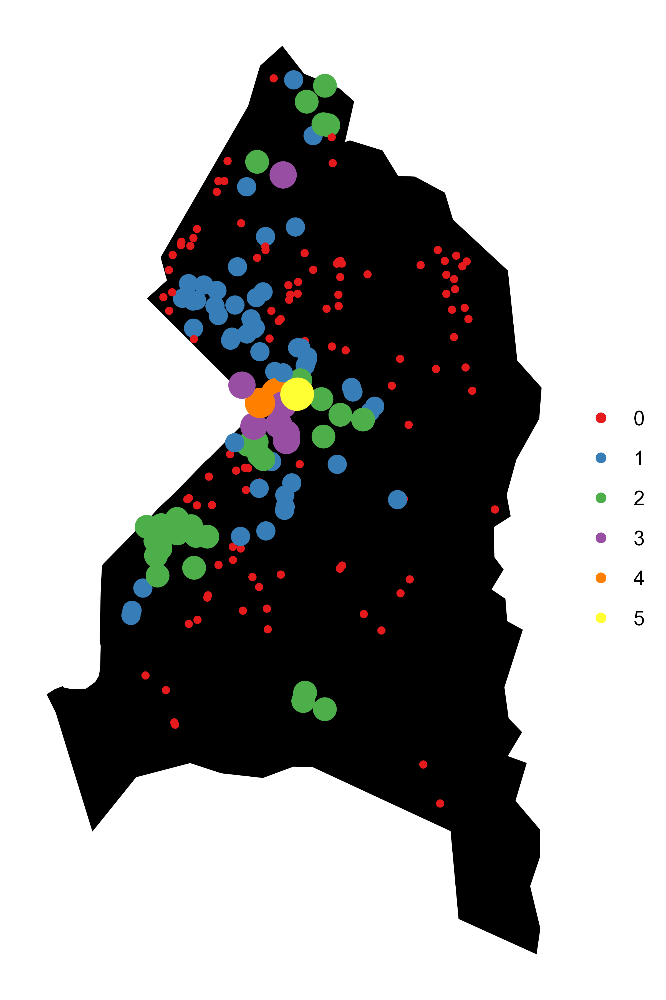

# Toxic waste and Prince George’s County public schools

## Introduction

The locations of toxic waste facilities have been established in the literature as a cause of adverse health outcomes^1^ and a symptom of systemic racism.^2^ But what of academic outcomes? Here I establish a method for calculating distance between schools and toxic waste facilities. This is a first step toward future research that could allow researchers to examine the relationship between academic outcomes and the locations of schools relative to toxic waste facilities.

## Data 
I leverage two data sources here: the EPA’s Facility Registry Service and the Maryland Department of Education’s Maryland Education Facilities. The Facility Registry Service is a registry of all entities that the EPA considers to be “either subject to environmental regulations or of environmental interest.”^3^ The FRS is a superset of the Toxic Release Inventory. I focus on contaminated and potentially contaminated sites, water systems, and brownfields sites. There are 23 of these sites in Prince George’s County. The Maryland schools data is a registry of all education facilities in Maryland. For the sake of theoretical and computational ease, I focus on only the 197 K-12 public schools in Prince George’s County. 

## Methods
One challenge with both datasets is their lack of latitude/longitude coordinate data. The FRS data relies on facility-reported location data, which is inconsistent. The schools data lacked latitude/longitude coordinates entirely. Both datasets, however, have addresses. I use Google’s Geocode API in tandem with the R package ggmap.^4^ to pull down coordinates based on these addresses, then calculate school-facility distances based on these coordinates using the haversine method.^5^ The result of these calculations is a list of dataframes, where each data frame contains information on the distance of one school to the 23 toxic waste facilities in the county. From these, a facility concentration can be calculated — in this case, the number of facilities within a two-mile radius of a school. The facility concentration for Prince George’s County public schools is depicted in the charts below and right.

## Facility Concentration

### Number of Facilities within a 2-mile radius
#### All K-12 Public Schools

#### Elementary, Middle, and High Schools

  
   
  

## Limitations

One major limitation of this study is that the data is limited only to Prince George’s County. Of course, the nearest facility to a school near the border of the county might be just over the border. Another is that the haversine method, unlike the computationally more intense Vincenty method, assumes a spherical Earth and ignores ellipsoid effects (though this may be negligible at sufficiently small distances).

## Conclusion and Next Steps
This method of calculating facility concentration is illuminating. Here, we see that schools with three or more facilities within a two-mile radius are concentrated in one area of the county. Further research might test facility concentration for relationships with a variety of academic outcomes, such as graduation rates and test scores, and with social factors like race. Depending on availability of data, longitudinal studies could allow researchers to link facility concentration during grade school to broader quality of life indicators.

## References
1. Carpenter, D. O., Ma, J., & Lessner, L. (2008). Asthma and infectious respiratory disease in relation to residence near hazardous waste sites. Annals of the New York Academy of Sciences, 1140, 201–208. https://doi.org/10.1196/annals.1454.000
2. United Church of Christ Commission for Racial Justice. (1987). Toxic wastes and race in the united states.
3. Environmental Protection Agency. Facility registry service (FRS). Retrieved from: https://www.epa.gov/frs.
4. Kahle D. & Wickham, H. ggmap: Spatial visualization with ggplot2. The R Journal, 5(1), 144-161. URL http://journal.r-project.org/archive/2013-1/kahle-wickham.pdf.
5. Hijmans, R. J. (2022). geosphere: spherical trigonometry. R package version 1.5-18. https://CRAN.R-project.org/package=geosphere.
6. County-level shapefiles from the Urban Institute facilitated the creation of these charts. Strochak, S. Ueyama, K., & Williams, A. (2022). urbnmapr: State and county shapefiles in sf and tibble format. R package version 0.0.0.9002. https://github.com/UrbanInstitute/urbnmapr.
